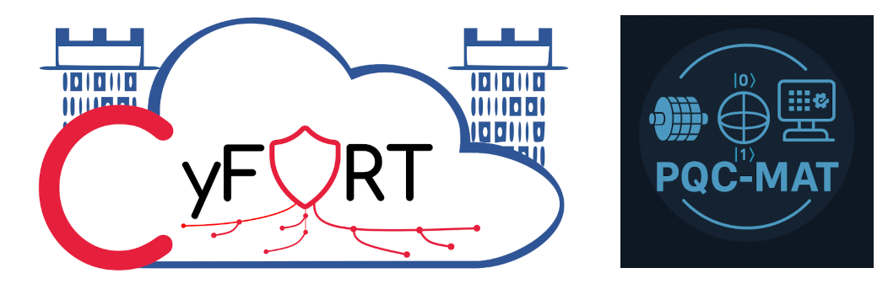
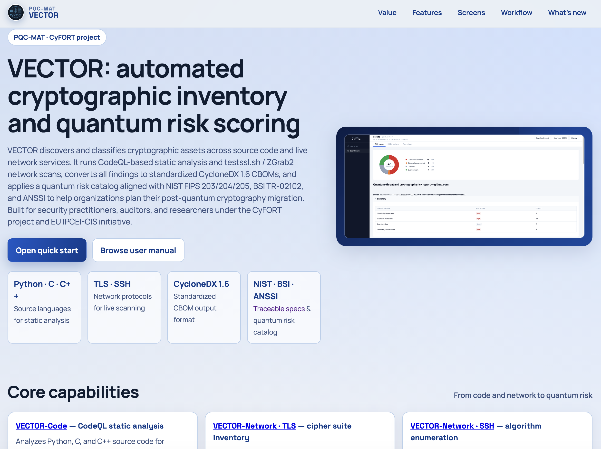
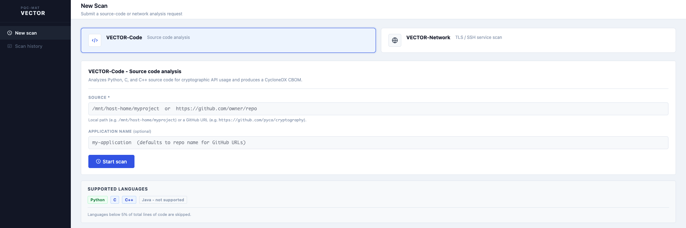
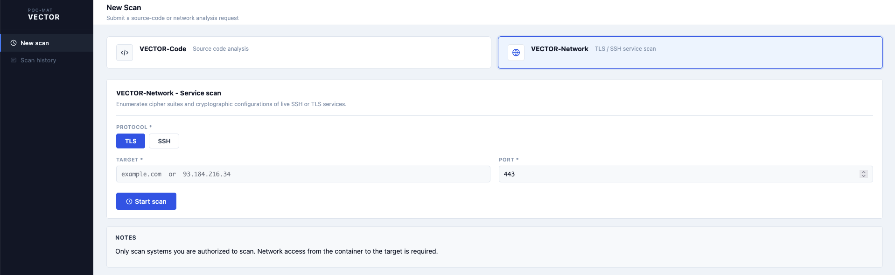
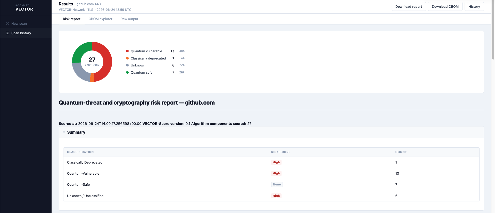
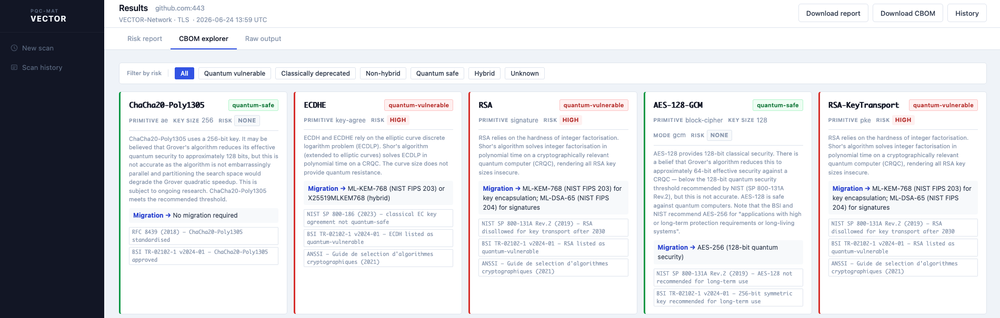

# PQC-MAT

The Post-Quantum Cryptography Migration Assistance Theory and Tools (**PQC-MAT**) project is a sub-project of [CyFORT](https://abstractionslab.com/index.php/research-and-development/cyfort/), standing for "Cloud Cybersecurity Fortress of Open Resources and Tools for Resilience", carried out in the context of the [IPCEI-CIS](https://ec.europa.eu/commission/presscorner/detail/en/ip_23_6246) project.



This repository hosts resources for a secure and methodological migration from classical to post-quantum cryptography (PQC) in cyber-physical systems. PQC migration replaces algorithms based on classical public-key cryptography with quantum-secure alternatives built on mathematical problems that cannot be efficiently solved by a Cryptographically Relevant Quantum Computer (CRQC). It currently provides two subsystems — **VEC** and **TOR**, which together form **VECTOR**: **VE**rified **C**ryptography and **T**ransition via **O**bservable **R**egistry.

Technical specifications are available on the [traceability web page](https://abstractionslab.github.io/pqc-mat/traceability/index.html). See the [user manual](/docs/manual/README.md) for details on installation, quick start, feature matrix, and system concept.

For a visual stakeholder-oriented tour of VECTOR, visit the **[product presentation page](https://abstractionslab.github.io/pqc-mat/website/product-presentation.html)**.



> **Security disclaimer:** PQC-MAT is to be currently viewed as a research and audit tool intended for use in controlled environments (e.g., isolated lab networks, Dev Containers). It is not hardened for production deployment. In particular, the network scanning scripts accept user-supplied hostnames that are passed to external tools without full input sanitization. Do not expose PQC-MAT to untrusted input or run it in a production or internet-facing environment.

## Table of contents

- [PQC-MAT suite](#pqc-mat-suite)
- [Quick start](#quick-start)
- [Documentation](#documentation)
- [Development](#development)
- [Requirements](#requirements)
- [Roadmap](#roadmap)
- [License](#license)
- [Acknowledgment](#acknowledgment)
- [Contact](#contact)

## PQC-MAT suite

PQC-MAT consists of two main modules:

### TOR — Transition via Observable Registry (cryptographic inventory tools)

[**TOR**](/tor/README.md) is an automated cryptographic inventory and analysis system that assesses organizational readiness for PQC migration. It discovers cryptographic assets across source code and network infrastructure and generates standardized [Cryptographic Bills of Materials (CBOM)](https://cyclonedx.org/capabilities/cbom/) in CycloneDX 1.6 format.

- **VECTOR-Code**: CodeQL-based static analysis of source code to detect cryptographic algorithm usage in Python, C, and C++ projects, producing SARIF findings converted to CBOM via cryptobom-forge.
- **VECTOR-Network**: Dynamic network scanning of TLS and SSH services using testssl.sh and ZGrab2, with full protocol version, cipher suite, key exchange, elliptic curve, and post-quantum/hybrid KEM inventory.
- **VECTOR-Score**: Quantum risk scoring for any CycloneDX CBOM. Classifies each algorithm component by its quantum risk posture using a data-driven catalog (NIST FIPS 203/204/205, BSI TR-02102, ANSSI) and produces an annotated CBOM plus a Markdown risk report.
- **VECTOR-GUI**: Browser-based Flask interface for submitting VECTOR-Code and VECTOR-Network scans, monitoring live terminal output, and reviewing results — risk report, CBOM explorer, and raw scanner output — without using the CLI.

**Built on:** [CodeQL](https://codeql.github.com/), [testssl.sh](https://testssl.sh/), [ZGrab2](https://github.com/zmap/zgrab2), [cryptobom-forge](https://github.com/Santandersecurityresearch/cryptobom-forge), [CycloneDX](https://cyclonedx.org/)

VECTOR-Network's custom parsers are the primary novel contribution: testssl.sh and ZGrab2 do not natively produce CBOM output. TOR bridges this gap, including full cipher suite decomposition into individual algorithm components and detection of hybrid post-quantum KEMs. VECTOR-Code automates an existing CodeQL + cryptobom-forge pipeline, which in some cases provides more comprehensive CBOMs compared to [CBOMkit](https://github.com/cbomkit/cbomkit), an established alternative for the same task. The combined value is a single, containerized workflow that produces standardized CycloneDX CBOMs across both code and network surfaces for PQC readiness audits.





### VEC — Verified Cryptography

[**VEC**](/vec/README.md) was developed during an internship by a mathematics MSc student. It currently provides an introductory tutorial on using [F*](https://www.fstar-lang.org/) (a proof-oriented programming language) to produce mathematically verified implementations of cryptographic functions. It demonstrates how to encode algorithm specifications with pre- and post-conditions, prove termination and correctness with SMT solver assistance, and automatically extract verified executable OCaml code.

The included worked example covers the **Extended Euclidean Algorithm (EEA)** — a foundational primitive in public-key cryptography (e.g., modular inverses for RSA).

## Quick start

### Decision tree

- **Need to inventory cryptographic assets in source code?** → use [VECTOR-Code](#vector-code-static-source-analysis)
- **Need to audit TLS/SSH cryptographic configurations?** → use [VECTOR-Network](#vector-network-network-scanning)
- **Have a CBOM and need quantum risk classification?** → use [VECTOR-Score](#vector-score-quantum-risk-scoring)
- **Exploring verified algorithm implementations?** → read the [F* sources](#vec-verified-cryptography)

### Setup

PQC-MAT runs inside a Docker Dev Container that pre-installs all required tools. No manual dependency management is needed.

**Prerequisites:** Docker, VS Code with the [Dev Containers](https://marketplace.visualstudio.com/items?itemName=ms-vscode-remote.remote-containers) extension.

```bash
# Open the project in VS Code, then:
# Command Palette → "Dev Containers: Reopen in Container"
```

The container automatically installs Python 3.11, Poetry, Go 1.25, CodeQL CLI, testssl.sh v3.3dev, ZGrab2, cloc, and cryptobom-forge. A test project ([pyca/cryptography](https://github.com/pyca/cryptography)) is pre-cloned at `/home/vector/test-project/cryptography`.

> **Note:** CodeQL CLI requires an x86_64 host. VECTOR-Code will not run on ARM-based machines.

### VECTOR-Code: static source analysis

```bash
# Analyse the bundled test project
vector code /home/vector/test-project/cryptography

# Analyse your own project, with a custom CBOM application name
vector code /path/to/your/project --name my-application

# Analyse code from your host machine (via /mnt/host-home mount)
vector code /mnt/host-home/path/to/your/project --name my-app
```

**Output structure:**

```
tor/vector_code/output/
├── databases/    # CodeQL databases per detected language
├── results/      # SARIF findings
└── cbom/         # CycloneDX CBOM JSON files
```

### VECTOR-Network: network scanning

```bash
# CLI mode
vector network --protocol tls --target example.com --port 443
vector network --protocol ssh --target 192.168.1.1 --port 22
```

Each scan produces a raw scanner output file and a CycloneDX CBOM:

```
{target}_tls_scan.json  /  {target}_ssh_scan.json
{target}_tls_cbom.json  /  {target}_ssh_cbom.json
```

### VECTOR-Score: quantum risk scoring

```bash
# Score a CBOM produced by VECTOR-Code or VECTOR-Network
vector score /path/to/cbom.json

# Specify output paths explicitly
vector score cbom.json --output cbom_scored.json --report risk_report.md
```

Outputs:

```
<stem>_scored.json      # annotated CBOM with pqcmat: risk properties on each algorithm
<stem>_risk_report.md   # Markdown summary grouped by risk classification
```

### VECTOR-GUI: web interface

VECTOR also provides a browser-based web interface built with Flask. See the [GUI quick start](./tor/gui/README.md) for setup and initialization steps. Run the GUI from inside the Dev Container as follows:

```bash
VECTOR_ROOT=/home/vector/vector-project VECTOR_PORT=5000 python3 tor/gui/app.py
```

Forward port `5000` in the VS Code **Ports** panel, then open `http://localhost:5000`. The interface covers the full VECTOR workflow: VECTOR-Code and VECTOR-Network scan submission, live terminal output streaming, and a results browser with a **risk report**, **CBOM explorer**, and **raw output** tab.





> **Disclaimer:** The GUI is still a work in progress. While functional, input validation and sanitization have not yet been fully implemented, and the backend code will still be subject to significant refactoring.

### VEC: verified cryptography

See this component's dedicated [README](/vec/README.md) and its [compilation guide](/vec/compilation-guide.md) for F* installation requirements and instructions for running the verified OCaml extraction.

## Documentation

- **User manual:** [`docs/manual/`](/docs/manual/) — installation, quick start, feature matrix, and system concept
- **Technical specifications:** [`docs/specs/`](/docs/specs/) — interlinked requirements (MRS, SRS, ARC, SWD, TCS, TRP) following the [C5-DEC](https://abstractionslab.github.io/c5dec/website/product-presentation.html) methodology
- **Traceability:** [published traceability page](https://abstractionslab.github.io/pqc-mat/traceability/index.html) — coverage analysis and interlinked HTML spec browser

## Development

```bash
# Install Python dependencies (from project root)
poetry install

# Run Doorstop structure validation
poetry run doorstop

# Publish specs and refresh traceability (when specs changed)
cd docs/specs && ./publish.sh
```

## Requirements

| Component | Requirement |
|-----------|-------------|
| **Host architecture** | x86_64 (CodeQL CLI limitation) |
| **Docker** | Required for Dev Container |
| **VS Code** | Dev Containers extension |
| **VECTOR-Code** | Python 3.11, CodeQL CLI, cloc, cryptobom-forge |
| **VECTOR-Network** | Python 3.11, testssl.sh, ZGrab2 |
| **VECTOR-Score** | Python 3.11, PyYAML (included in Poetry dependencies) |

All VECTOR-Code and VECTOR-Network dependencies are automatically provisioned by the Dev Container.

## Roadmap

- Extended PQC algorithm coverage in VECTOR-Network
- Extended programming language support in VECTOR-Code
- Automated CBOM aggregation across code and network surfaces
- CBOM diff / migration progress tracker (baseline vs. current scan)

## License

Copyright © itrust Abstractions Lab and itrust consulting. All rights reserved.

Licensed under the [GNU Affero General Public License (AGPL) v3.0](LICENSE).

## Acknowledgment

Co-funded by the Ministry of the Economy of Luxembourg in the context of the CyFORT project.

## Contact

Abstractions Lab: info@abstractionslab.lu