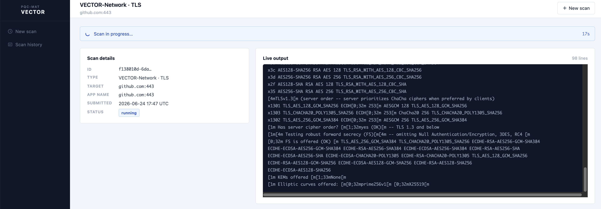

# Quick start

All commands are run from inside the Dev Container.

## Web interface

VECTOR provides a browser-based interface for submitting and monitoring scans, available as an alternative to the CLI for both VECTOR-Code and VECTOR-Network.

### Starting the web interface

```bash
# Install Flask (one-time setup, inside the Dev Container)
pip install flask --break-system-packages

# Start the web server
VECTOR_ROOT=/home/vector/vector-project VECTOR_PORT=5000 python3 tor/gui/app.py
```

Forward port `5000` in the VS Code **Ports** panel, then open `http://localhost:5000`.

### VECTOR-Code scan

Select **VECTOR-Code** on the New Scan page. Enter a local source directory path (e.g. `/mnt/host-home/myproject`) or a GitHub repository URL. The application name is optional.


### VECTOR-Network scan

Select **VECTOR-Network** on the New Scan page. Choose **TLS** or **SSH**, enter the target hostname or IP address, and set the port number.


### Scan progress

After submission, a scan details page shows the scan ID, type, target, and live status alongside a real-time output terminal.



Completed scans are accessible from **Scan history** in the left sidebar.

---

## VECTOR-Code

Analyzes source code to detect programming languages and build CodeQL databases for cryptographic analysis.

```bash
vector code <path> [--name <app_name>]
```

**Arguments:**

| Argument | Required | Default | Description |
|----------|----------|---------|-------------|
| `path` | Yes | — | Path to the project directory to analyze |
| `--name` | No | `application` | Application name written into CBOM metadata |

A test project is pre-loaded in the container at `/home/vector/test-project/cryptography` ([pyca/cryptography](https://github.com/pyca/cryptography)):

```bash
vector code /home/vector/test-project/cryptography --name pyca-cryptography
```

Code from your host machine can also be scanned using the `/mnt/host-home` mount:

```bash
vector code /mnt/host-home/path/to/your/project --name my-app
```

**Example output:**

```
Language detection
  Detected: Python (18.8%)

Creating CodeQL databases
  Created: db-python

Running crypto queries
  Generated: crypto-python.sarif

Generating CBOM
  Generated: crypto-python-cbom.json

Completed
```

**Output structure:**

```
tor/VECTOR-Code/output/
├── databases/        CodeQL databases (one per language)
│   └── db-python/
├── results/          SARIF analysis results
│   └── crypto-python.sarif
└── cbom/             CycloneDX CBOM files
    └── crypto-python-cbom.json
```

**Notes:**
- Language detection threshold is 5% of total lines of code. Languages below this threshold are skipped.
- Supported languages: Python, C, C++. Java is not currently supported (no CodeQL queries are available).
- Output is written relative to the `tor/VECTOR-Code/` directory; re-running overwrites existing output.
- Multi-language projects produce a single unified CBOM (`crypto-combined-cbom.json`).
- Output is CycloneDX 1.6 JSON, compatible with any CycloneDX-compliant tool.
- See [VECTOR-Code reference](./vector-code.md) for full details.

## VECTOR-Network

Scans network services to identify cryptographic configurations and generate CBOMs.

```bash
vector network --protocol <ssh|tls> --target <host> --port <port>
```

### CLI mode

```bash
vector network --protocol tls --target example.com --port 443
vector network --protocol ssh --target github.com --port 22
```

### Interactive mode

Running without arguments launches an interactive menu:

```
Select protocol
  1. SSH (port 22)
  2. TLS (port 443)
  3. Custom
Choice (1/2/3): _
```

### TLS scan example

```
Choice (1/2/3): 2
Target (domain or IP): example.com
```

Output files (written to the current working directory):
- `example_com_tls_scan.json` — raw testssl.sh output
- `example_com_tls_cbom.json` — CycloneDX CBOM

### SSH scan example

```
Choice (1/2/3): 1
Target (domain or IP): github.com
```

Output files:
- `github_com_ssh_scan.json` — raw ZGrab2 output
- `github_com_ssh_cbom.json` — CycloneDX CBOM

### Custom port

Select option `3` to specify a non-standard port for either protocol.

### Re-processing existing scan files

The converter scripts can be run standalone if you already have raw scan output and want to regenerate the CBOM without re-scanning:

```bash
cd tor/vector_network
python3 zgrab2_to_cbom.py <target>_ssh_scan.json
python3 testssl_to_cbom.py <target>_tls_scan.json
```

See [VECTOR-Network reference](./vector-network.md) for full details.

## Working with results

After a scan, the generated CBOM JSON files can be:

- **Inspected directly** — open the file in any text editor or JSON viewer; see [Understanding CBOM output](./cbom-output.md) for an annotated walkthrough.
- **Loaded into CBOMkit** — for visualization, risk scoring, and quantum-vulnerability assessment (requires CBOMkit setup; see CBOMkit documentation).
- **Processed programmatically** — the files are standard CycloneDX 1.6 JSON; any CycloneDX-compatible tool can consume them.

## Known limitations

- **x86_64 only**: The CodeQL CLI is not available for ARM64; GitHub does not provide an ARM64 build.
- **Single target per invocation**: Neither VECTOR-Code nor VECTOR-Network supports scanning multiple targets in a single run.
- **Network access required for VECTOR-Network**: The container must be able to reach the target host on the specified port.
