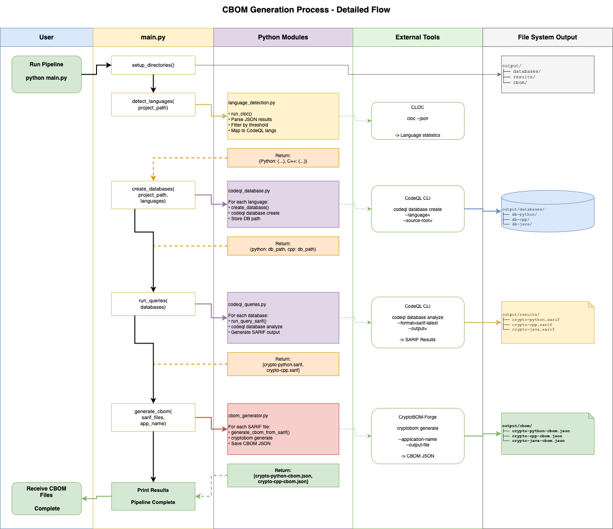

# VECTOR-Code processing component

## Architecture design artifact

The VECTOR-Code component accepts a readable source-tree path, detects supported languages, creates CodeQL databases, runs inventory queries, and converts resulting findings into CBOM artifacts.

## Processing pipeline

