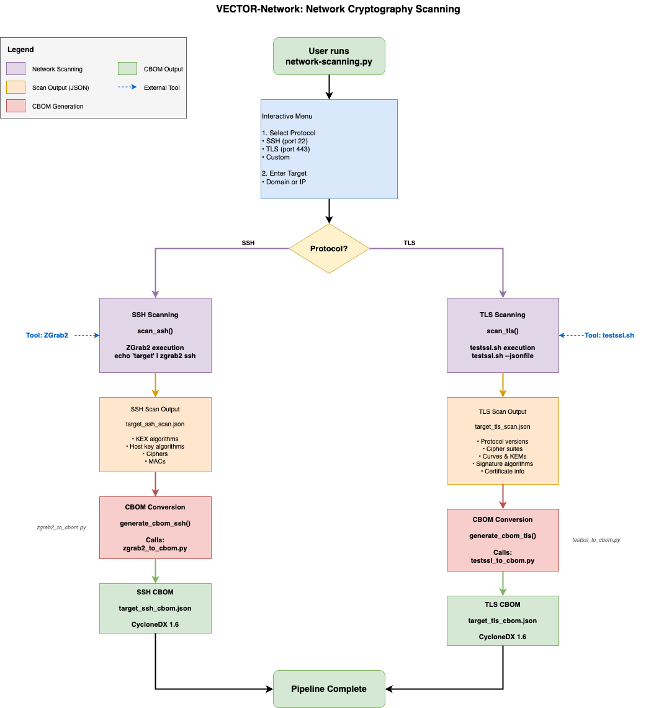

# External analysis tool adapters

## Architecture design artifact

VECTOR delegates core analysis steps to external tools including cloc, CodeQL, cryptobom, testssl.sh, and zgrab2, and wraps them through thin orchestration scripts.

## VECTOR-Network scanning workflow

